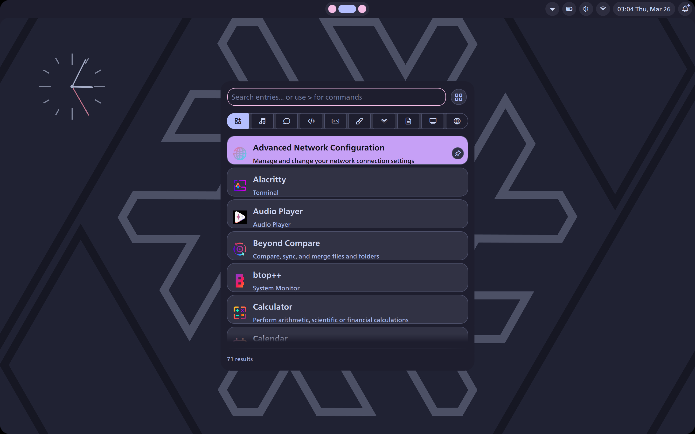
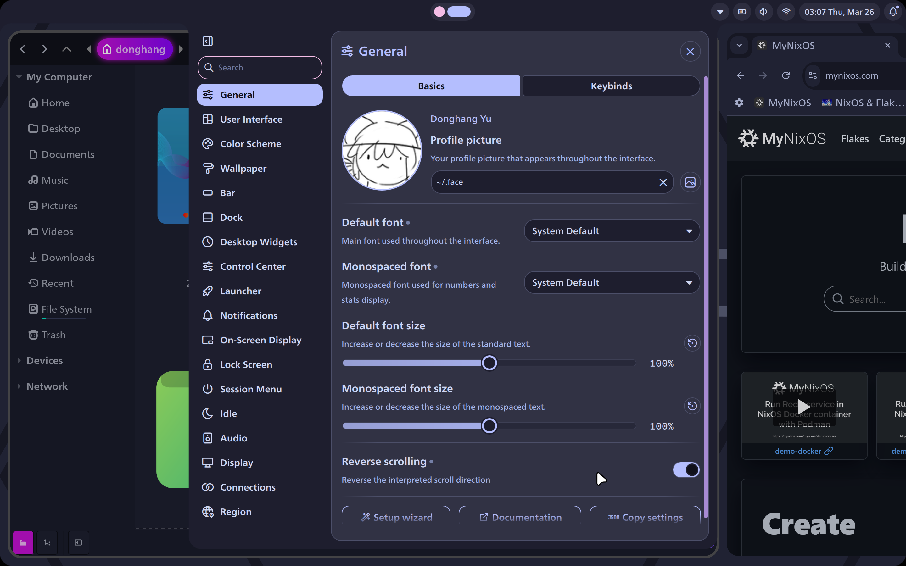

<!--
███╗   ███╗██████╗ ██╗  ██╗███╗   ██╗
████╗ ████║██╔══██╗██║  ██║████╗  ██║
██╔████╔██║██║  ██║███████║██╔██╗ ██║
██║╚██╔╝██║██║  ██║╚════██║██║╚██╗██║
██║ ╚═╝ ██║██████╔╝     ██║██║ ╚████║
╚═╝     ╚═╝╚═════╝      ╚═╝╚═╝  ╚═══╝
-->

# MD4N: My Dotfiles for NixOS

[](https://nixos.org)
[](https://github.com/nix-community/home-manager)
[](https://github.com/W4T4r/MD4N/actions/workflows/ci.yml)
[](https://wayland.freedesktop.org)
[](https://github.com/YaLTeR/niri)
[](https://github.com/catppuccin/catppuccin)

MD4N is a modular NixOS + Home Manager setup built around Niri, Noctalia, and a script-driven workflow.
This top-level README is the operator guide: how to install it, regenerate machine-local state, apply changes, and find the detailed documentation for each part of the repository.

## Preview

| Launcher | Settings |
| --- | --- |
| [](assets/screenshots/launcher-overview.png) | [](assets/screenshots/settings-overview.png) |

## Before You Start

- This repository targets NixOS on `x86_64-linux`.
- Shared defaults live in [user.nix](user.nix).
- The root [flake.nix](flake.nix) is the shared base flake and exports reusable builders and modules.
- Machine-local answers are generated into `local/generated/user.nix` by [scripts/configure-local.sh](scripts/configure-local.sh).
- The active machine entrypoint can live in `local/flake.nix`, which wraps the shared root flake and can add private inputs.
- Local Home Manager and NixOS overrides belong under `local/home-manager/` and `local/nixos/`.
- `local_templates/` contains the tracked starter files and documentation for the ignored local tree.
- `private_templates/MD4N-private/` contains a tracked starter for a separate private local-config repository.
- Generated local state should be regenerated through the scripts, not hand-edited.
- `direnv` users can run `direnv allow` in the repository root to load the local validation toolchain automatically.

## Quick Start

Clone the repository and run the entrypoint:

```bash
git clone https://github.com/W4T4r/MD4N
cd MD4N
bash install.sh
```

`install.sh` and `bootstrap.sh` now guide the operator into the interactive local setup flow before `configure-local.sh` generates or updates the ignored `local/` tree.

The normal flow is:

1. [install.sh](install.sh)
2. [scripts/bootstrap.sh](scripts/bootstrap.sh)
3. [scripts/configure-local.sh](scripts/configure-local.sh)
4. [scripts/forge.sh](scripts/forge.sh)

## Daily Use

Use the script layer instead of raw commands whenever possible.

- Open the main console with [scripts/mn.sh](scripts/mn.sh)
- Regenerate machine-local answers with [scripts/configure-local.sh](scripts/configure-local.sh)
- Regenerate Niri display outputs with [scripts/configure-niri-outputs.sh](scripts/configure-niri-outputs.sh)
- Apply changes with [scripts/forge.sh](scripts/forge.sh)
- Roll back with [scripts/rollback.sh](scripts/rollback.sh)
- Clean up and maintain generations with [scripts/tune.sh](scripts/tune.sh)

If you need to change machine-local answers later, re-run [scripts/configure-local.sh](scripts/configure-local.sh) and then apply again.

For input methods, the shared setup now keeps Japanese input on Fcitx5 through
Hazkey and Mozc, and Simplified Chinese input on Fcitx5 through Pinyin from
`fcitx5-chinese-addons`.
The detailed Fcitx5 layout is documented in
[home-manager/config/fcitx5/README.md](home-manager/config/fcitx5/README.md).

## Local Validation

If you use `direnv`, run `direnv allow` once in the repository root.
That loads the flake dev shell with local validation tools such as `alejandra`, `shellcheck`, `statix`, `deadnix`, and `actionlint`.

The main validation entrypoint remains:

```bash
nix flake check
```

The repository checks now cover:

- Nix formatting through `alejandra`
- Nix hygiene through `deadnix`
- shell lint through `shellcheck`
- shell syntax for the script layer and private template scripts
- GitHub Actions validation through `actionlint`
- smoke coverage for the documented `--help` entrypoints
- a private workflow smoke test that scaffolds and links a temporary `MD4N-private` machine profile

The dev shell still exposes `statix` for manual Nix linting when you want style suggestions that are broader than the enforced gate.

If `local/flake.nix` exists, you can validate the machine-local entrypoint with:

```bash
nix flake check path:./local
```

## Setup Behavior

During setup, MD4N can run in guided mode or automatic mode.

- Guided mode asks for identity, locale, time zone, hostname, package profile, virtualization, GPU vendor, browser choice, fingerprint support, dual-boot support, hibernate support, the AI tools bundle, the TeX and Zotero bundle, and profile-specific package choices.
- Automatic mode keeps the main machine-detection path and only asks for the choices that still need operator input.
- The selected package profile drives both NixOS and Home Manager behavior.
- Personal machine-local packages and inputs stay in `local/` modules and `local/flake.nix` instead of the shared root flake.

Current profiles:

- `minimal`: lighter baseline with virtualization disabled
- `full`: default workstation profile with Chrome, Thunderbird, and virtualization desktop helpers enabled by default

## Local State and Private Overrides

This repository is both the shared configuration base and the local operational checkout.

- Regenerate machine-local answers with [scripts/configure-local.sh](scripts/configure-local.sh) instead of editing `local/generated/user.nix` manually.
- Keep generated machine state in `local/`.
- Keep reusable defaults in the shared repository modules.
- Keep secrets, licensed software wiring, and hand-maintained personal overrides out of the shared tree.

For local configuration that you want to maintain yourself over time, the recommended pattern is:

1. Keep it in a separate private repository.
2. Link the runtime path to that private repository.
3. Let the shared MD4N repository manage only the reusable base and the generated machine state.

The tracked starter for that private repository lives in [private_templates/MD4N-private](private_templates/MD4N-private/README.md).
The recommended management workflow is documented in [docs/private-repo.md](docs/private-repo.md).
After the private repo is linked, keep doing day-to-day operations from the main `MD4N/` checkout with [scripts/mn.sh](scripts/mn.sh).
If you are unsure where a change belongs, use [docs/editing-guide.md](docs/editing-guide.md).

This works especially well for app-managed config that is easier to edit in place, such as linked trees under `~/.config`.
Examples include local shell snippets, window-manager runtime files, and application configs that are usually edited from inside the app itself.

## Repository Guide

Use these documents when you want the detailed explanation for each area:

- [NixOS Overview](nixos/README.md): system-level structure, entrypoints, and module ownership
- [NixOS Modules](nixos/modules/README.md): what each system module is responsible for
- [Home Manager Overview](home-manager/README.md): user-level structure and how files are linked into the home directory
- [Home Manager Modules](home-manager/modules/README.md): core, programs, services, fonts, and package layering
- [Home Manager Package Profiles](home-manager/modules/packages/README.md): the role of `minimal` and `full`
- [Local Templates](local_templates/README.md): tracked starter files and documentation for the ignored local runtime tree
- [Private Repo Guide](docs/private-repo.md): when to use a separate private repo and how to manage it
- [Editing Guide](docs/editing-guide.md): where shared, local, generated, and private changes belong
- [Private Repo Template](private_templates/README.md): tracked starter content for separate private repositories
- [Shared Config Tree](home-manager/config/README.md): what belongs under the repository-managed config tree
- [Fcitx5](home-manager/config/fcitx5/README.md): Japanese and Chinese input layout and shared profile
- [Desktop Entry Overrides](home-manager/applications/README.md): how `.desktop` overrides are organized
- [Wallpapers](home-manager/Wallpapers/README.md): wallpaper assets bundled with the setup
- [Scripts](scripts/README.md): install, apply, rollback, and maintenance workflow
- [Shared Nix Helpers](lib/README.md): optional merge and normalization helpers for user settings
- [Documentation Assets](assets/README.md): screenshots and other repository-owned media
- [Troubleshooting](docs/troubleshooting.md): common install, setup, and apply failures
- [Third-Party Notices](THIRD_PARTY_NOTICES.md): bundled assets that carry upstream attribution or license requirements

## Important Files

- [flake.nix](flake.nix): shared base flake, exported modules, and builder functions
- [local_templates/README.md](local_templates/README.md): local runtime layout, starter files, and ignored paths
- [private_templates/MD4N-private/README.md](private_templates/MD4N-private/README.md): starter for a separate `MD4N-private` repository
- [docs/editing-guide.md](docs/editing-guide.md): decision guide for shared vs local vs private edits
- [user.nix](user.nix): repository-safe shared defaults
- [lib/user.nix](lib/user.nix): merge and normalization layer for user settings
- [nixos/configuration.nix](nixos/configuration.nix): stable NixOS entrypoint
- [home-manager/home.nix](home-manager/home.nix): stable Home Manager entrypoint

## Notes

- Wayland-first desktop centered on Niri and Noctalia
- Input methods are configured around Fcitx5, with Hazkey and Mozc for Japanese and Pinyin for Simplified Chinese
- GNOME is present as a compatibility layer, not as the primary desktop
- The repository scripts are added to `PATH` through Home Manager
- Niri and Fish keep shared config in the repo while allowing a few ignored machine-local files to live beside the linked trees

## License

This project is licensed under the MIT License. See [LICENSE](LICENSE).
